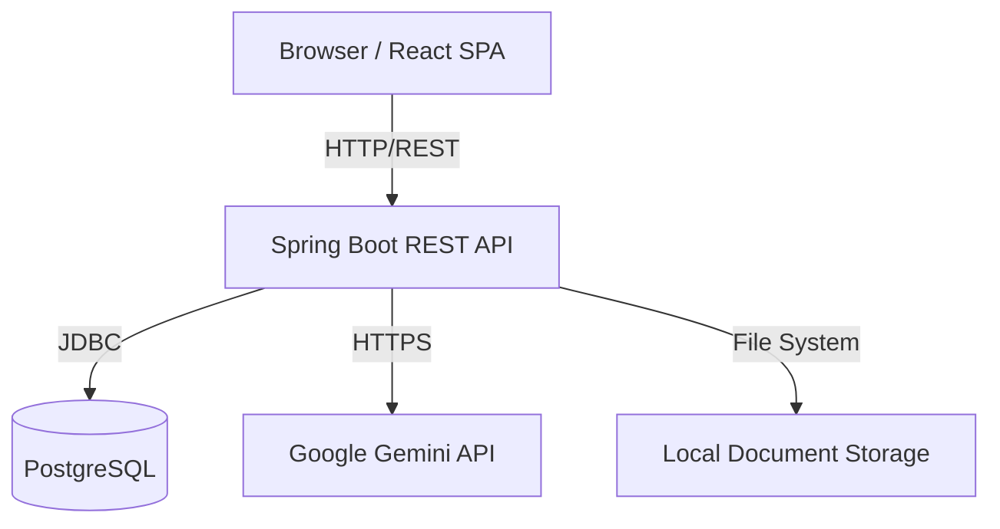
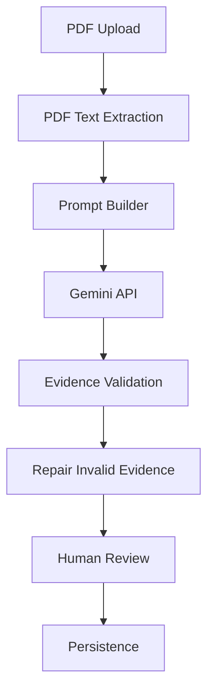

# RecallPath AI

[English](README.md) | [Español](docs/README.es.md)

[](https://github.com/AngelicaGuerOl/recallpath-ai/actions/workflows/ci.yml)

RecallPath AI is a study application designed to help students and researchers generate, manage, and practice flashcards. Built with a Spring Boot backend, a React frontend, and the Google Gemini API, it transforms static PDF documents into interactive study materials. 

The application exists to reduce the manual effort of flashcard creation. It ensures that AI-generated study aids remain grounded in the user's specific source material. It supports practice modes including traditional recall, multiple-choice, and semantic written-answer evaluation.

---

## Application Preview

| Deck Overview | Flashcard Management |
|---|---|
|  |  |

| PDF Generation | Generated-Card Review |
|---|---|
|  |  |

| Practice Mode Selection | Written-Answer Evaluation |
|---|---|
|  |  |

| Multiple-Choice Practice | Traditional Flashcards |
|---|---|
|  |  |

---

## Business Problem

Creating study materials manually is a time-consuming process that distracts learners from actual studying. 

While generic AI tools can generate flashcards quickly, they often lack specific context. They produce definitions that do not match the exact nuances of the user's source material, such as academic papers or specific textbooks.

RecallPath AI solves this by allowing users to upload PDF documents and explicitly select the pages to process. The system ensures that all generated flashcards are grounded in the selected text by validating each card against a literal source excerpt. 

This provides the speed of AI generation combined with the accuracy of manual curation.

---

## Core Features

- **Context-Aware AI Generation**: Extract text from specific PDF pages and generate flashcards using Google Gemini.
- **Source-Grounded Validation**: Verify generated flashcards against literal source excerpts to prevent hallucinations.
- **Human-in-the-Loop Curation**: Review, edit, approve, or reject AI-generated cards before adding them to a deck.
- **Deck & Card Management**: Perform CRUD operations for decks and manual flashcards, including archiving.
- **Adaptive Practice Modes**: Study using Traditional Recall, Multiple-Choice, or Written-Answer modes.
- **Semantic Answer Evaluation**: Practice written answers in your own words. The AI evaluates whether your response captures the core semantic idea.

---

## Technical Highlights

- **Feature-Oriented Layered Architecture**: Vertical slicing by domain (e.g., decks, flashcards, documents) to isolate features.
- **Spring Boot REST API**: Backend utilizing Java 21, Spring Data JPA, and Bean Validation.
- **React Frontend**: Structured around Clean Architecture principles, separating domain logic from UI components.
- **DTO Contracts**: Separation between database entities and API payloads using MapStruct.
- **OpenAPI/Swagger**: Auto-generated API documentation.
- **Flyway Migrations**: Version-controlled PostgreSQL schema evolution.
- **Local PDF Processing**: Text extraction handled locally via Apache PDFBox.
- **React Query**: Frontend data fetching, caching, and state synchronization.
- **CI/CD Pipeline**: Automated GitHub Actions workflows for integration and testing.
- **Docker Environment**: Containerized development setup.

---

## Technology Stack

| Area | Technologies |
|---|---|
| **Backend** | Java 21, Spring Boot 4.1, Spring Data JPA, Apache PDFBox, OpenAPI/Swagger, MapStruct |
| **Frontend** | React 19, TypeScript, Material UI (MUI), Vite 8, React Query, React Router |
| **Database** | PostgreSQL 16, Flyway |
| **AI Integration** | Google Gemini API (`google-genai`) |
| **Infrastructure** | Docker, Docker Compose, Makefile, GitHub Actions |
| **Quality** | JUnit 5, Testcontainers, Vitest 4, ESLint, happy-dom |

---

## Architecture

RecallPath AI enforces a strict separation of concerns to simplify testing and maintenance.

### Request Flows

**1. Frontend Request Flow**

```text
Page / Component
↓
Custom Hook
↓
Use Case / Service
↓
Repository
↓
HTTP Client (Fetch)
↓
REST API
```

**2. Backend Request Flow**

```text
Controller
↓
Service
↓
Repository
↓
PostgreSQL
```

### Business Rules & Orchestration

- **Business Rules**: Domain rules (e.g., validating that a practice session belongs to a specific deck) reside in the Backend `Service` layer and are enforced by Bean Validation.
- **AI Orchestration**: The AI generation process executes asynchronously. The call to the Gemini API executes outside of the main database transaction to prevent connection pool exhaustion. Validation and persistence occur in atomic transactions after the network call completes.

### System Architecture



### AI Generation Pipeline



---

## Design Decisions

- **Why PDFBox?** To extract text locally without relying on third-party cloud parsing services.
- **Why Source-Grounded Validation?** LLMs are prone to hallucinations. Forcing the AI to cite literal excerpts from the provided text verifies that the generated flashcards are factually accurate relative to the source.
- **Why Human-in-the-loop?** AI is an assistant, not a replacement for human judgment. A staging area allows users to curate study material before persistence.
- **Why a Fake AI Provider?** To enable local development and automated testing without incurring API costs, the system implements a `FakeGeminiService` that returns mocked responses.
- **Why Gemini outside transactions?** Network calls to LLMs can take several seconds. Holding a database transaction open would exhaust the connection pool under load.
- **Why Flyway?** To maintain strict, version-controlled database schemas across environments.
- **Why React Query?** To handle asynchronous state, caching, and background refetching in the frontend.

---

## Local Development

### Requirements
- Docker and Docker Compose
- Make (optional, but recommended)
- Node.js 20+ (if running frontend outside Docker)
- Java 21 (if running backend outside Docker)

### Environment Setup

Clone the repository and configure your environment variables:

```bash
cp .env.example .env
```

*Note: Set `AI_PROVIDER=fake` in `.env` to run the application locally without requiring a Google Gemini API key.*

### Development Commands

Start the stack using the provided `Makefile`:

```bash
make dev-up
```

To stop the environment and remove containers:

```bash
make dev-down
```

### Development URLs
- **Frontend App**: `http://localhost:5173`
- **Backend API**: Proxied through Vite via `/api` (port 8080 internal)
- **Swagger UI**: `http://localhost:8080/swagger-ui.html`

---

## API Documentation

The backend provides interactive API documentation generated by OpenAPI/Swagger. 

Once the development environment is running, navigate to the Swagger UI endpoint (`http://localhost:8080/swagger-ui.html`) to explore the available REST endpoints, schemas, and test requests directly from the browser. 

Key documented domains include:
- `/api/decks`
- `/api/flashcards`
- `/api/documents`
- `/api/generation-runs`
- `/api/practice-sessions`

---

## Verification

The project enforces code quality through continuous integration and automated testing.

- **Backend Tests**: JUnit 5 is used for unit testing business logic in the Service and Mapper layers.
- **Integration Tests**: `@SpringBootTest` paired with `Testcontainers` spins up PostgreSQL instances to verify Repository queries, Flyway migrations, and Controller endpoints via `MockMvc`.
- **Frontend Verification**: Vitest and React Testing Library verify component rendering and hook behavior in a simulated DOM environment (`happy-dom`).
- **Linting**: ESLint enforces strict TypeScript and React rules.
- **Build Verification**: The TypeScript compiler (`tsc -b`) ensures type safety before Vite bundles the production assets.
- **CI Verification**: GitHub Actions automatically triggers on push and pull request events, running the full suite of backend and frontend tests.

---

## Testing

**Testing Strategy**: The backend employs a testing pyramid. It prioritizes unit tests for domain logic and utilizes Testcontainers for repository and integration paths. The frontend focuses on component-level testing and hook logic validation.

**Limitations**: End-to-end (E2E) UI testing is currently not implemented.

---

## Documentation

For technical specifics, refer to the internal documentation:

- [Architecture](docs/architecture.md)
- [AI Integration](docs/ai-integration.md)
- [API Overview](docs/api-overview.md)
- [Business Rules](docs/business-rules.md)
- [Database Schema](docs/database.md)
- [Development Guide](docs/development-guide.md)
- [User Guide](docs/user-guide.md)
- [Troubleshooting](docs/troubleshooting.md)

---

## Security and Privacy

- **Authentication**: The application is designed for single-user local deployment. There is no authentication or multi-tenant authorization layer, and all endpoints are public.
- **API Keys**: The `.env` file is excluded via `.gitignore`. The `GEMINI_API_KEY` is not committed to version control.
- **Document Privacy**: Uploaded PDFs are stored locally on the Docker volume. Only the raw text extracted from explicitly selected pages is sent over HTTPS to the Google Gemini API.
- **Local Isolation**: By utilizing the Fake AI Provider and local PostgreSQL containers, the application can run entirely offline without exposing data.

---

## Scope and Limitations

The following features are intentionally out of scope for the current version:

- **User Authentication**: Operates as a single-tenant application.
- **Cloud Object Storage**: Documents are stored on the local file system rather than AWS S3.
- **Multimodal Generation**: The AI integration processes text only; it does not extract or analyze images embedded within PDFs.
- **Spaced Repetition Algorithm**: The flashcard practice mode relies on manual user review choices rather than an automated SM-2 scheduler.

---

## Roadmap

**Short-term**
- Implement user authentication and role-based access control.
- Add multi-tenant data isolation for cloud deployment.

**Medium-term**
- Integrate spaced repetition algorithms (e.g., SM-2) for automated recall practice scheduling.

**Long-term**
- Add support for extracting images from PDFs to generate multimodal flashcards.
- Implement cloud object storage support (AWS S3) for document management.

---

## License

This project is a professional portfolio piece. The source code is public for review and demonstration purposes, but it is currently unlicensed. All rights are reserved by the author.

---

## Author

Developed by Angelica Guerrero.

Computer Science student focused on Java, Spring Boot, React, and AI-assisted applications.
