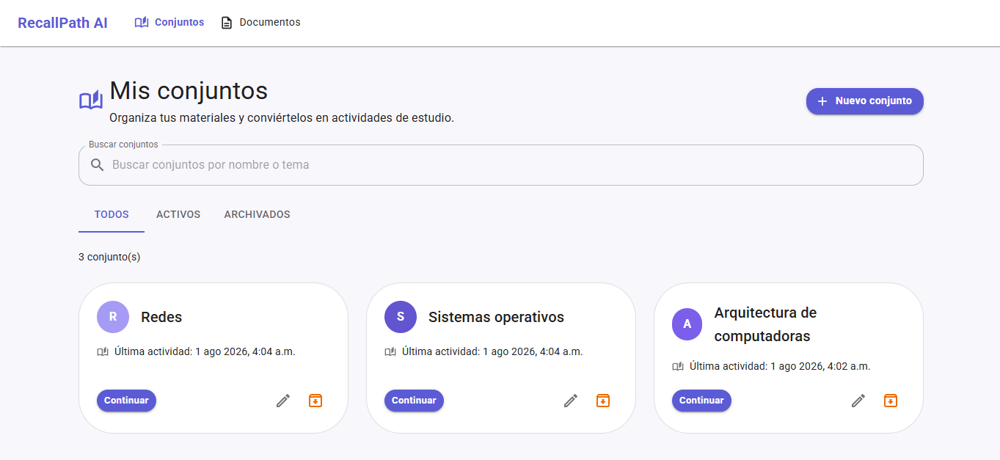
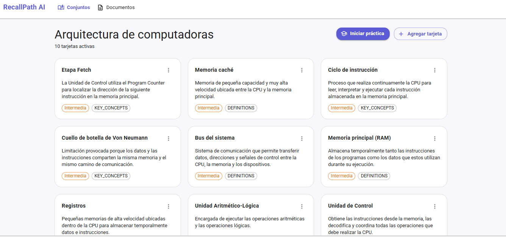
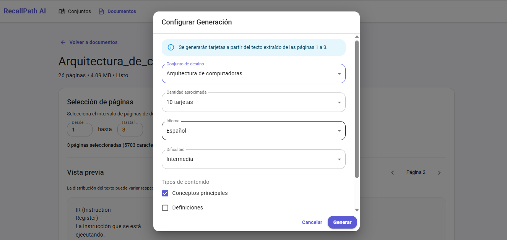
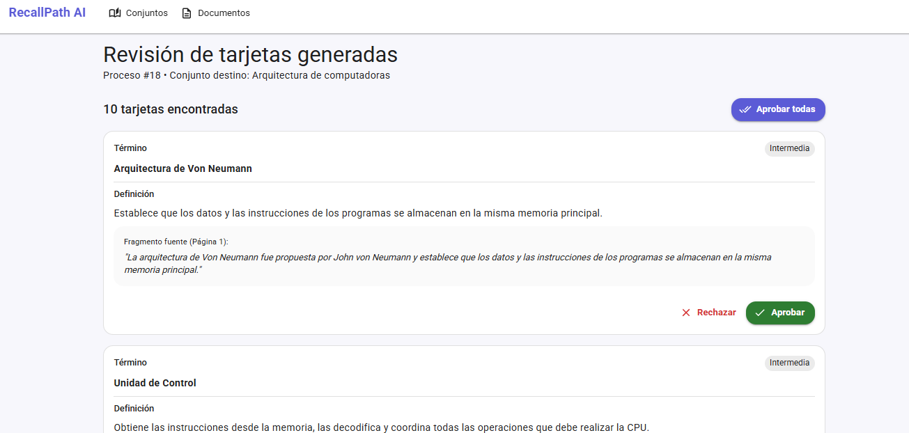
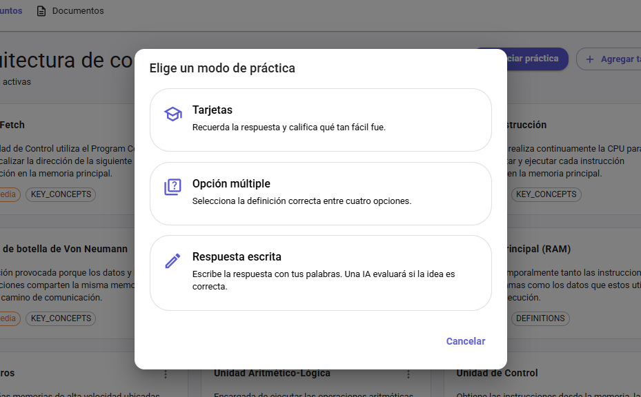
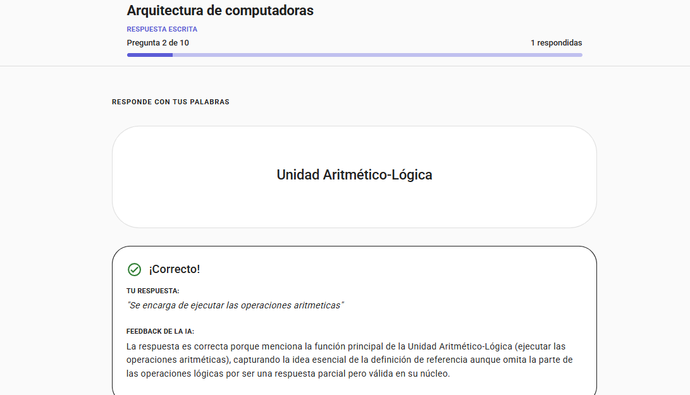

# RecallPath AI

## Project Overview

RecallPath AI is a monorepo with a Spring Boot backend, React frontend, Docker configuration, operational scripts, and documentation. It is an AI-assisted study application designed to help users generate, manage, and practice flashcards. It uses Google Gemini to automatically generate flashcards from PDF documents and allows users to practice them using different learning modes, including semantic evaluation of written answers.

## Problem Solved

Creating flashcards manually is a tedious, time-consuming process. Generic AI-generated flashcards often lack context and provide definitions that don't match specific source material. RecallPath AI allows users to upload their own PDF documents and select specific pages to generate highly relevant flashcards grounded in the selected source pages.

## Key Features

- **Deck Management**: Create, edit, archive, and restore study decks.
- **Manual & AI Flashcards**: Add flashcards manually or generate them using Google Gemini.
- **PDF Document Processing**: Upload PDFs, extract text page-by-page using PDFBox, and select specific pages for generation.
- **Human-in-the-Loop Review**: Review, edit, approve, or reject AI-generated flashcards before adding them to your deck.
- **Three Practice Modes**: Traditional recall, multiple-choice, and written-answer semantic evaluation.
- **Source-Grounded AI Generation**: Validates each generated flashcard against a literal excerpt from the selected source page and attempts to repair invalid evidence before rejecting the generation result.

## Application Workflow

1. **Create a Deck**: Create a study deck to organize your topics.
2. **Add Content**: Add flashcards manually or upload a PDF document.
3. **Select Pages**: Preview the PDF and select the specific pages you want to study.
4. **Generate Flashcards**: Request AI generation. PDFBox extracts the text locally, and Gemini generates the cards based on that text.
5. **Review**: Check the generated flashcards, edit them if needed, and approve or reject them.
6. **Practice**: Choose a practice mode and start a session.
7. **Review Results**: After the session, review your accuracy and retry the concepts you missed.

## Screenshots

### Deck Overview
Manage all your active and archived study decks in a responsive grid.



### Flashcard Management
Add, edit, or archive flashcards inside a specific deck.



### PDF Generation
Upload documents and choose exactly which pages the AI should read.



### Generated-Card Review
Review AI-generated flashcards before saving them.



### Practice Mode Selection
Choose between different modes depending on your study needs.



### Written-Answer Evaluation
Type your answer in your own words, and Gemini will evaluate it semantically.



## Practice Modes

1. **Recall Practice (Flashcards)**: Traditional mode where you self-evaluate your recall as Easy, Good, Hard, or Again.
2. **Multiple-Choice**: Select the correct definition from 4 options.
3. **Written-Answer**: Type your explanation. Google Gemini evaluates if your answer correctly expresses the core idea, accepting synonyms and paraphrasing.

## Technology Stack

- **Backend**: Java 21, Spring Boot 4.1, Spring Data JPA, PostgreSQL, Flyway, Apache PDFBox, OpenAPI/Swagger.
- **Frontend**: React, TypeScript, Material UI (MUI), Vite, React Query.
- **AI Integration**: Google Gemini SDK (`google-genai`).
- **Infrastructure**: Docker, Docker Compose, Makefile, GitHub Actions (CI/CD).

## Architecture Summary

RecallPath AI follows a feature-oriented layered architecture:
- **Backend Architecture**: The backend is organized by features with controller, service, repository, entity, DTO, mapper, and exception layers. It exposes interactive REST API documentation via **OpenAPI/Swagger**.
- **Frontend Architecture**: The frontend uses a feature-oriented architecture inspired by Clean Architecture principles, with separation between domain, application, infrastructure, and user interface.
- **Database & Storage**: A PostgreSQL database stores decks, flashcards, practice sessions, and documents. Apache PDFBox extracts text locally from PDFs before sending it to the AI.
- **AI Provider**: Google Gemini provides AI capabilities through HTTPS calls for flashcard generation and semantic evaluation.
- **CI/CD**: GitHub Actions automatically build and test the codebase on every push.

## Getting Started

### Prerequisites
- Docker and Docker Compose
- Make (optional, but recommended)

### Environment Setup
Copy the example environment file and configure your variables:

```bash
cp .env.example .env
```

Set `AI_PROVIDER=fake` in `.env` to run locally without a real API key.

## Main Commands

Use the provided `Makefile` to start the application:

```bash
make dev-up
```

The frontend will be available at `http://localhost:5173`. Docker development API requests are automatically forwarded through the Vite `/api` proxy. The backend is not directly exposed on port 8080 by default unless explicitly published in the Compose overrides.

To stop the environment:
```bash
make dev-down
```

## Testing

To run the backend test suite:
```bash
cd recallpath-backend
./mvnw test
```

## Current Status

The project is currently in active development. The core features are fully implemented and functional.

## Roadmap

- **Short-term**: Implement user authentication and multi-tenant data isolation.
- **Medium-term**: Add spaced repetition algorithms (e.g., SM-2) for the recall practice mode.
- **Long-term**: Support for extracting images from PDFs and generating multimodal flashcards.

## Documentation

- [Architecture](docs/architecture.md)
- [AI Integration](docs/ai-integration.md)
- [API Overview](docs/api-overview.md)
- [Business Rules](docs/business-rules.md)
- [Database Schema](docs/database.md)
- [Development Guide](docs/development-guide.md)
- [User Guide](docs/user-guide.md)
- [Troubleshooting](docs/troubleshooting.md)

## Security and Privacy

- **No Authentication**: The application currently does not implement authentication or authorization. All REST API endpoints are public. Authentication and multi-user isolation remain roadmap items.
- **API Keys**: Never commit your `.env` file or `GEMINI_API_KEY` to version control.
- **Document Privacy**: PDFs are stored locally in the Docker volume. Only the extracted text from explicitly selected pages is sent to the Google Gemini API.
- **Provider Choice**: You can use the `fake` provider (`AI_PROVIDER=fake`) during development to avoid sending any data to external APIs.
