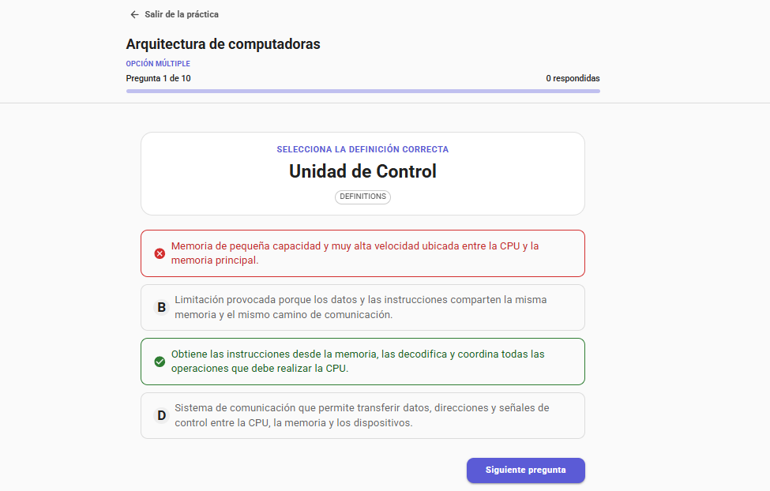
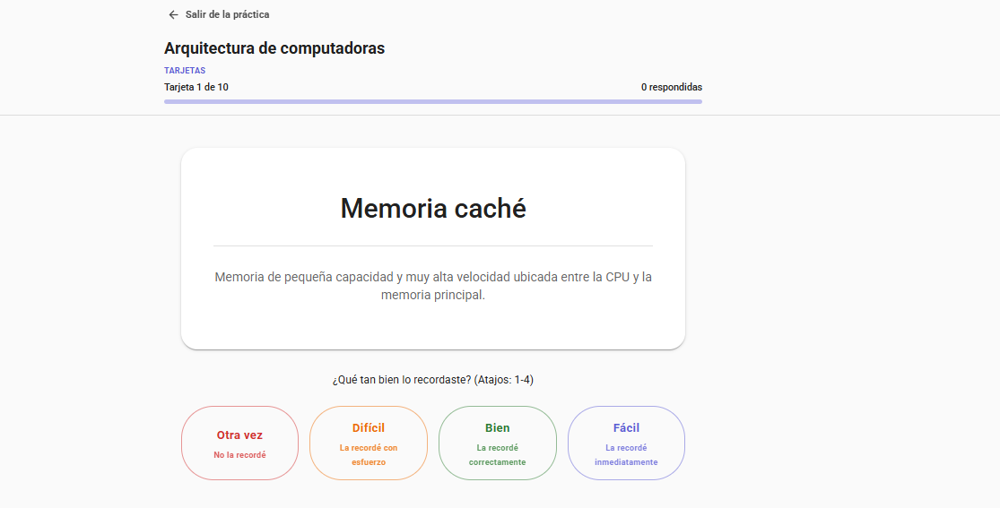
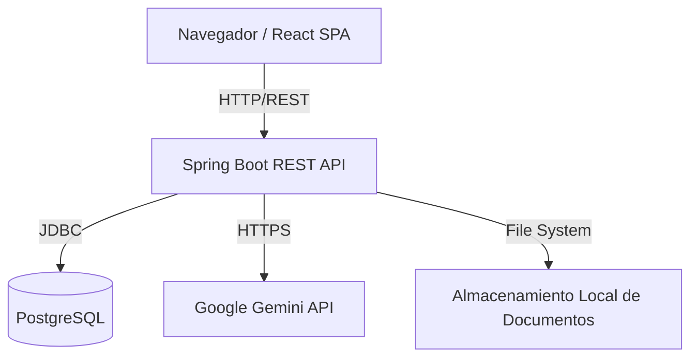
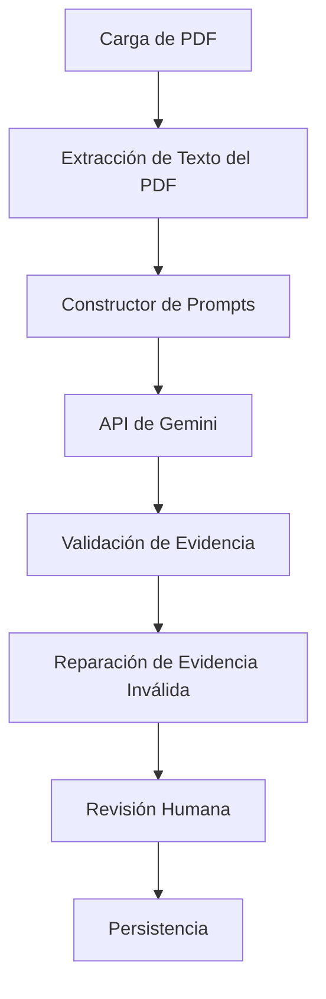

# RecallPath AI

[English](../README.md) | [Español](README.es.md)

[](https://github.com/AngelicaGuerOl/recallpath-ai/actions/workflows/ci.yml)

RecallPath AI es una aplicación de estudio diseñada para ayudar a estudiantes e investigadores a generar, gestionar y practicar tarjetas de estudio (flashcards). Construida con un backend en Spring Boot, un frontend en React y la API de Google Gemini, transforma documentos PDF estáticos en materiales de estudio interactivos.

La aplicación existe para reducir el esfuerzo manual de creación de tarjetas de estudio. Garantiza que el material de estudio generado por IA se mantenga fiel al material de origen específico del usuario. Soporta modos de práctica incluyendo recuerdo tradicional, opción múltiple y evaluación semántica de respuestas escritas.

---

## Vista Previa de la Aplicación

| Vista General de Conjuntos | Gestión de Tarjetas |
|---|---|
|  |  |

| Generación desde PDF | Revisión de Tarjetas Generadas |
|---|---|
|  |  |

| Selección del Modo de Práctica | Evaluación de Respuesta Escrita |
|---|---|
|  |  |

| Práctica de Opción Múltiple | Tarjetas Tradicionales |
|---|---|
|  |  |

---

## Problema de Negocio

Crear materiales de estudio de forma manual es un proceso que consume mucho tiempo y distrae a los estudiantes del estudio en sí.

Si bien las herramientas genéricas de IA pueden generar tarjetas rápidamente, a menudo carecen de contexto específico. Producen definiciones que no coinciden con los matices exactos del material fuente del usuario, como artículos académicos o libros de texto específicos.

RecallPath AI resuelve esto permitiendo a los usuarios subir documentos PDF y seleccionar explícitamente las páginas a procesar. El sistema asegura que todas las tarjetas generadas estén basadas en el texto seleccionado mediante la validación de cada tarjeta contra un fragmento literal del origen.

Esto proporciona la velocidad de la generación por IA combinada con la precisión de la curaduría manual.

---

## Características Principales

- **Generación por IA Basada en Contexto**: Extrae texto de páginas específicas del PDF y genera tarjetas usando Google Gemini.
- **Validación Basada en la Fuente**: Verifica las tarjetas generadas contra fragmentos literales de la fuente para prevenir alucinaciones.
- **Curaduría Humana en el Bucle**: Revisa, edita, aprueba o rechaza las tarjetas generadas por IA antes de añadirlas a un conjunto.
- **Gestión de Tarjetas y Conjuntos**: Realiza operaciones CRUD para conjuntos y tarjetas manuales, incluyendo el archivado.
- **Modos de Práctica Adaptativos**: Estudia usando los modos de Recuerdo Tradicional, Opción Múltiple o Respuesta Escrita.
- **Evaluación Semántica de Respuestas**: Practica respuestas escritas con tus propias palabras. La IA evalúa si tu respuesta captura la idea semántica central.

---

## Aspectos Técnicos Destacados

- **Arquitectura en Capas Orientada a Características**: División vertical por dominio (ej. conjuntos, tarjetas, documentos) para aislar las características.
- **API REST en Spring Boot**: Backend que utiliza Java 21, Spring Data JPA y Bean Validation.
- **Frontend en React**: Estructurado bajo principios de Clean Architecture, separando la lógica de dominio de los componentes de UI.
- **Contratos DTO**: Separación entre entidades de base de datos y payloads de la API usando MapStruct.
- **OpenAPI/Swagger**: Documentación de la API generada automáticamente.
- **Migraciones Flyway**: Evolución del esquema de PostgreSQL controlada por versiones.
- **Procesamiento Local de PDF**: Extracción de texto manejada localmente mediante Apache PDFBox.
- **React Query**: Sincronización de estado, caché y obtención de datos en el frontend.
- **Pipeline CI/CD**: Flujos de trabajo automatizados de GitHub Actions para integración y pruebas.
- **Entorno Docker**: Configuración de desarrollo contenerizada.

---

## Pila Tecnológica (Tech Stack)

| Capa | Tecnologías |
|---|---|
| **Backend** | Java 21, Spring Boot 4.1, Spring Data JPA, Apache PDFBox, OpenAPI/Swagger, MapStruct |
| **Frontend** | React 19, TypeScript, Material UI (MUI), Vite 8, React Query, React Router |
| **Base de Datos** | PostgreSQL 16, Flyway |
| **Integración de IA** | Google Gemini API (`google-genai`) |
| **Infraestructura** | Docker, Docker Compose, Makefile, GitHub Actions |
| **Calidad** | JUnit 5, Testcontainers, Vitest 4, ESLint, happy-dom |

---

## Arquitectura

RecallPath AI aplica una estricta separación de responsabilidades para simplificar las pruebas y el mantenimiento.

### Flujos de Petición

**1. Flujo de Petición del Frontend**

```text
Página / Componente
↓
Hook Personalizado
↓
Caso de Uso / Servicio
↓
Repositorio
↓
Cliente HTTP (Fetch)
↓
API REST
```

**2. Flujo de Petición del Backend**

```text
Controlador
↓
Servicio
↓
Repositorio
↓
PostgreSQL
```

### Reglas de Negocio y Orquestación

- **Reglas de Negocio**: Las reglas de dominio (ej. validar que una sesión de práctica pertenece a un conjunto específico) residen en la capa `Servicio` del Backend y son aplicadas mediante Bean Validation.
- **Orquestación de IA**: El proceso de generación por IA se ejecuta de forma asíncrona. La llamada a la API de Gemini se ejecuta fuera de la transacción principal de la base de datos para prevenir el agotamiento del pool de conexiones. La validación y persistencia ocurren en transacciones atómicas tras completarse la llamada de red.

### Arquitectura del Sistema



### Pipeline de Generación por IA



---

## Decisiones de Diseño

- **¿Por qué PDFBox?** Para extraer texto localmente sin depender de servicios de análisis en la nube de terceros.
- **¿Por qué Validación Basada en la Fuente?** Los LLM son propensos a las alucinaciones. Forzar a la IA a citar fragmentos literales del texto provisto verifica que las tarjetas generadas sean fidedignas con respecto a la fuente.
- **¿Por qué el Humano en el bucle?** La IA es un asistente, no un reemplazo del juicio humano. Una zona de pruebas permite a los usuarios curar el material de estudio antes de persistirlo.
- **¿Por qué un Proveedor de IA Falso?** Para permitir el desarrollo local y pruebas automatizadas sin incurrir en costes de API, el sistema implementa un `FakeGeminiService` que devuelve respuestas simuladas.
- **¿Por qué Gemini fuera de transacciones?** Las llamadas de red a LLMs pueden tardar varios segundos. Mantener una transacción de base de datos abierta agotaría el pool de conexiones bajo carga.
- **¿Por qué Flyway?** Para mantener esquemas de base de datos estrictos y controlados por versiones en diferentes entornos.
- **¿Por qué React Query?** Para manejar el estado asíncrono, la caché y la recarga de fondo en el frontend.

---

## Desarrollo Local

### Requisitos
- Docker y Docker Compose
- Make (opcional, pero recomendado)
- Node.js 20+ (si se ejecuta el frontend fuera de Docker)
- Java 21 (si se ejecuta el backend fuera de Docker)

### Configuración del Entorno

Clona el repositorio y configura tus variables de entorno:

```bash
cp .env.example .env
```

*Nota: Configura `AI_PROVIDER=fake` en `.env` para ejecutar la aplicación localmente sin requerir una clave de API de Google Gemini.*

### Comandos de Desarrollo

Inicia la infraestructura completa usando el `Makefile` proporcionado:

```bash
make dev-up
```

Para detener el entorno y eliminar los contenedores:

```bash
make dev-down
```

### URLs de Desarrollo
- **App Frontend**: `http://localhost:5173`
- **API Backend**: Enrutada a través de Vite vía `/api` (puerto 8080 interno)
- **Swagger UI**: `http://localhost:8080/swagger-ui.html`

---

## Documentación de la API

El backend proporciona documentación interactiva de la API generada por OpenAPI/Swagger.

Una vez el entorno de desarrollo esté en ejecución, navega al endpoint de Swagger UI (`http://localhost:8080/swagger-ui.html`) para explorar los endpoints REST disponibles, esquemas y probar peticiones directamente desde el navegador.

Principales dominios documentados incluyen:
- `/api/decks`
- `/api/flashcards`
- `/api/documents`
- `/api/generation-runs`
- `/api/practice-sessions`

---

## Verificación

El proyecto aplica la calidad del código mediante integración continua y pruebas automatizadas.

- **Pruebas del Backend**: Se utiliza JUnit 5 para las pruebas unitarias de la lógica de negocio en las capas Servicio y Mapper.
- **Pruebas de Integración**: `@SpringBootTest` emparejado con `Testcontainers` levanta instancias de PostgreSQL para verificar consultas de Repositorio, migraciones de Flyway y endpoints de Controlador vía `MockMvc`.
- **Verificación del Frontend**: Vitest y React Testing Library verifican el renderizado de componentes y el comportamiento de hooks en un entorno DOM simulado (`happy-dom`).
- **Linter (Linting)**: ESLint aplica reglas estrictas de TypeScript y React.
- **Verificación de Construcción**: El compilador de TypeScript (`tsc -b`) asegura la seguridad de tipos antes de que Vite empaquete los activos de producción.
- **Verificación CI**: GitHub Actions se dispara automáticamente en eventos push y pull request, ejecutando la suite completa de pruebas de backend y frontend.

---

## Pruebas

**Estrategia de Pruebas**: El backend emplea una pirámide de pruebas. Prioriza pruebas unitarias para la lógica de dominio y utiliza Testcontainers para rutas críticas de repositorio e integración. El frontend se centra en pruebas a nivel de componente y validación de lógica de hooks.

**Limitaciones**: Las pruebas UI End-to-end (E2E) no están implementadas actualmente.

---

## Documentación

Para detalles técnicos específicos, consulta la documentación interna:

- [Arquitectura](architecture.md)
- [Integración de IA](ai-integration.md)
- [Visión General de la API](api-overview.md)
- [Reglas de Negocio](business-rules.md)
- [Esquema de Base de Datos](database.md)
- [Guía de Desarrollo](development-guide.md)
- [Guía de Usuario](user-guide.md)
- [Solución de Problemas](troubleshooting.md)

---

## Seguridad y Privacidad

- **Autenticación**: La aplicación está diseñada para despliegue local de un solo usuario. No existe autenticación ni capa de autorización multi-usuario, y todos los endpoints son públicos.
- **Claves API**: El archivo `.env` se excluye mediante `.gitignore`. La variable `GEMINI_API_KEY` no se sube al control de versiones.
- **Privacidad de Documentos**: Los PDFs subidos se almacenan localmente en el volumen de Docker. Solo el texto crudo extraído de las páginas seleccionadas explícitamente se envía por HTTPS a la API de Google Gemini.
- **Aislamiento Local**: Al utilizar el Proveedor de IA Falso y contenedores PostgreSQL locales, la aplicación puede ejecutarse completamente offline sin exponer datos.

---

## Alcance y Limitaciones

Las siguientes características quedan intencionalmente fuera de alcance para la versión actual:

- **Autenticación de Usuarios**: Opera como una aplicación de un solo usuario (single-tenant).
- **Almacenamiento de Objetos en la Nube**: Los documentos se almacenan en el sistema de archivos local en lugar de en AWS S3.
- **Generación Multimodal**: La integración de IA procesa únicamente texto; no extrae ni analiza imágenes embebidas en los PDFs.
- **Algoritmo de Repetición Espaciada**: El modo de práctica de tarjetas se basa en elecciones de revisión manuales por parte del usuario en lugar de un programador automatizado SM-2.

---

## Hoja de Ruta (Roadmap)

**A corto plazo**
- Implementar autenticación de usuarios y control de acceso basado en roles.
- Añadir aislamiento de datos multi-usuario para despliegue en la nube.

**A medio plazo**
- Integrar algoritmos de repetición espaciada (ej. SM-2) para la programación automatizada de práctica de recuerdo.

**A largo plazo**
- Añadir soporte para extracción de imágenes desde PDFs para generar tarjetas multimodales.
- Implementar soporte para almacenamiento de objetos en la nube (AWS S3) para la gestión de documentos.

---

## Licencia

Este proyecto es una pieza de portafolio profesional. El código fuente es público para fines de revisión y demostración, pero actualmente no tiene licencia. Todos los derechos están reservados por el autor.

---

## Autor

Desarrollado por Angelica Guerrero.
