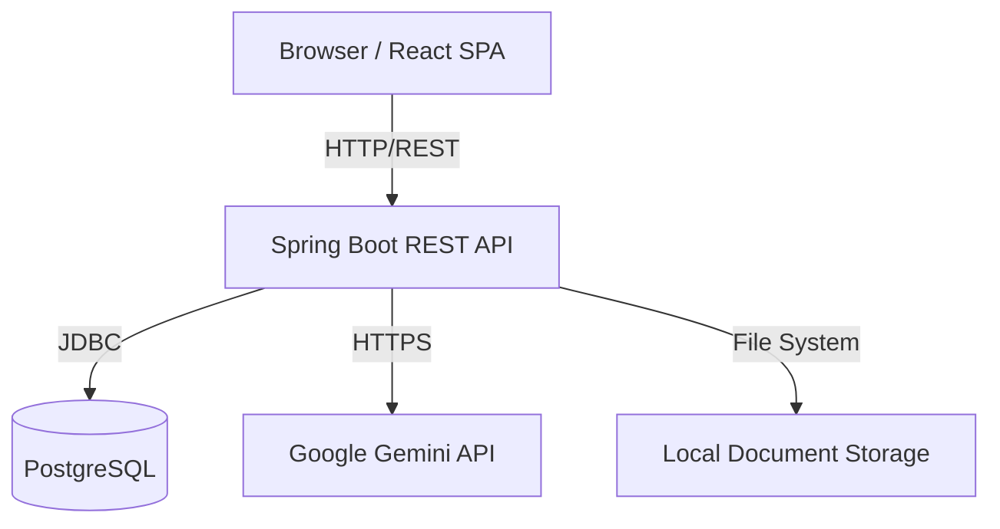
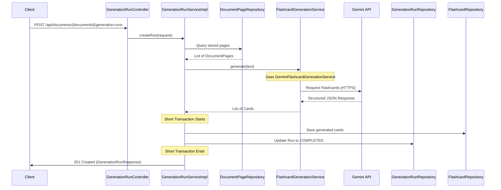

# Architecture

RecallPath AI follows a feature-oriented layered architecture with a clear separation of concerns between the frontend, backend, and external services.

## High-Level Architecture

The system is composed of the following main components:

1. **Browser / React SPA**: Handles the user interface, routing, and state management. It communicates with the backend via REST APIs.
2. **Spring Boot REST API**: Exposes endpoints, enforces business rules, manages database transactions, and orchestrates calls to external AI providers.
3. **PostgreSQL**: Stores all persistent relational data securely.
4. **Local Document Storage**: For local development, PDF files are stored using a Docker volume. The current production Compose overlay does not mount the document volume; therefore, production deployment requires persistent document storage to be configured separately.
5. **Google Gemini**: The AI provider, accessed through HTTPS calls, processes PDF text to generate flashcards and evaluates written answers semantically.

## Backend Organization

The backend is organized by feature domains (e.g., `deck`, `flashcard`, `document`, `practice`, `features.generation`).

Each domain typically follows the Controller-Service-Repository pattern:

- **Controllers**: Handle HTTP requests, input validation, and mapping between DTOs and internal domain models.
- **Services**: Contain the core business logic, transaction management (`@Transactional`), and orchestration.
- **Repositories**: Handle data access using Spring Data JPA.

## Flashcard Generation Flow

When a user requests flashcard generation from a PDF (`POST /api/documents/{documentId}/generation-runs`), the following precise flow occurs:

1. **Upload & Processing**: The PDF was previously processed during upload. PDFBox already extracted and saved the text per page into the database (`DocumentPage`).
2. **Context Building**: During the generation run, `GenerationRunServiceImpl` queries the already stored `DocumentPage` entities for the requested pages.
3. **AI Execution**: The actual call to the Google Gemini API (via `GeminiFlashcardGenerationService`) happens **outside of a database transaction** to prevent holding database connections open during long network calls.
4. **Validation & Persistence**: The JSON result is validated. The newly generated cards and the final status of the generation run are then saved using short, atomic transactions. The endpoint returns a `GenerationRunResponse`. Users can retrieve the actual generated cards via `GET /api/generation-runs/{runId}/flashcards`.

## Semantic Evaluation Flow

The semantic evaluation of written answers is an entirely separate AI flow.

1. When a user submits an answer in `WRITTEN_RESPONSE` mode, `PracticeController` receives the request. `PracticeServiceImpl` then orchestrates fetching the reference definition and the evaluation process.
2. The service calls `SemanticEvaluationService` (implemented by `GeminiSemanticEvaluationService`).
3. The AI evaluates if the user's answer captures the core concept (accepting synonyms and paraphrasing) and returns a boolean result and a string of feedback.
4. The result is immediately persisted in `PracticeAttempt` and returned to the frontend.
