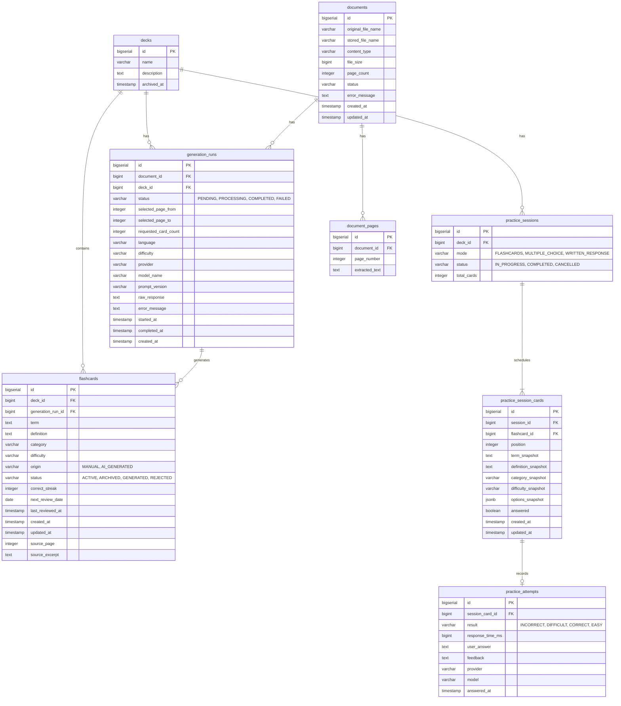

# Database Schema

RecallPath AI uses PostgreSQL as its primary data store. The schema is fully managed and versioned using Flyway (`V1` to `V10`).

## Entity-Relationship Diagram

## Important Tables & Constraints

### 1. `decks`
- **Purpose**: Groups flashcards and practice sessions.
- **Constraints**: 
  - `archived_at` is `NULL` if active. If a timestamp is present, the deck is archived.

### 2. `flashcards`
- **Purpose**: Stores the actual study terms and definitions.
- **Constraints**:
  - `origin` check constraint: `IN ('MANUAL', 'AI_GENERATED')`
  - `status` check constraint: `IN ('ACTIVE', 'ARCHIVED', 'GENERATED', 'REJECTED')`
  - When `origin` is `AI_GENERATED`, the `generation_run_id` links back to the AI run that produced it, and `source_page` (integer) / `source_excerpt` store the exact provenance of the information.

### 3. `documents` & `document_pages`
- **Purpose**: Stores uploaded PDF metadata and the raw text extracted per page.
- **Constraints**: The actual PDF file is stored on the filesystem referenced by `stored_file_name`. The document is not directly linked to a deck; instead, the connection to a deck is established during the generation process via `generation_runs`.

### 4. `generation_runs`
- **Purpose**: Tracks lifecycle and audit records for synchronous AI generation requests linking a document to a deck.
- **Columns**:
  - `selected_page_from` and `selected_page_to`: Define the page range requested by the user.
  - `status`: Transitions from `PENDING` -> `PROCESSING` -> `COMPLETED` (or `FAILED`).
  - `provider`, `model_name`, `prompt_version`, and `raw_response`: Kept for strict auditing of the exact AI configuration and response.

### 5. `practice_sessions`
- **Purpose**: Represents a point-in-time study session.
- **Constraints**:
  - `mode` check constraint: `IN ('FLASHCARDS', 'MULTIPLE_CHOICE', 'WRITTEN_RESPONSE')`
  - `status` check constraint: `IN ('IN_PROGRESS', 'COMPLETED', 'CANCELLED')`

### 6. `practice_session_cards` & `practice_attempts`
- **Purpose**: `practice_session_cards` locks in the list of cards for a session. `practice_attempts` records the user's answer.
- **Important Columns**:
  - `result`: Records the evaluation outcome (`INCORRECT`, `DIFFICULT`, `CORRECT`, `EASY`).
  - `user_answer`: The raw string typed by the user (or the multiple-choice option selected).
  - `feedback`: The semantic evaluation feedback returned by Gemini (if applicable).
  - `provider` and `model`: The AI configuration used to grade the answer.
  - `response_time_ms`: Measures the time taken to answer.
